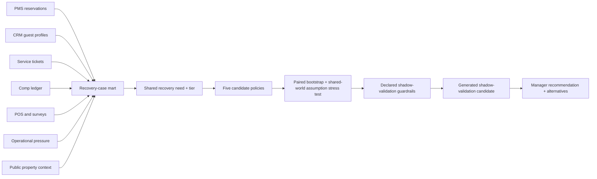

# Hotel Comp Policy Model

An explainable comp-policy decision system for a luxury lifestyle hotel:

> How should a luxury hotel make comp decisions more consistent and explainable without weakening guest recovery or manager judgment?

The operating principle is **intelligent generosity**: protect the guest relationship and brand experience while controlling inconsistent recovery and unnecessary room-rate erosion.

## Stakeholder Recommendation

Do not change comp policy from synthetic results. Begin with a data and policy workshop, then run an invisible shadow evaluation for four weeks or 50 eligible recovery cases, whichever is later. Compare model recommendations with manager decisions, actual marginal cost, operational feasibility, and observed guest outcomes before deciding whether a controlled policy test is warranted.

The simulation demonstrates the workflow behind that evaluation: guest-recovery safeguards first, cost comparisons second, and real outcomes as the final decision evidence. It does not identify an optimal policy for Proper Hotels.

## Example Manager Decision

```text
Recommended recovery: $180 Calabra or Palma dining credit
Assumed internal cost range: $45-$108
Decision confidence: high
Manager review required: no

Counterfactuals:
Without the operating-availability signal: $360 room upgrade
Without the property-fit signal: $100 late checkout
```

All operating records, comp history, guest values, margins, and outcomes are synthetic. Official Santa Monica Proper pages provide bounded public context for available experiences and guest-facing value anchors. The project does not use or claim access to Proper Hotels internal data, policy, inventory, rates, margins, or guest records.

## Three-Minute Review

1. Open the hosted [stakeholder decision framework](https://grant-mccurdy.github.io/projects/hotel-comp-policy-model/).
2. Review the decision sequence, synthetic policy comparison, worked case, and controlled validation path.
3. Read the [policy decision analysis](reports/policy-decision-analysis.md), [methodology](reports/methodology-and-assumptions.md), and [engineering evidence](reports/engineering-evidence.md).

The [technical policy prototype](reports/interactive-policy-prototype.html), hosted [simulation audit](https://grant-mccurdy.github.io/projects/hotel-comp-policy-model/simulation-audit.html), [executive brief](reports/executive-comp-optimization-brief.md), and [official-property context](reports/proper-public-context.md) are supporting artifacts. The primary `index.html` and PDF are rendered from `reports/hotel-comp-decision-framework.qmd` with R and Quarto.

## Decision Workflow



The source layer intentionally includes missing identifiers, duplicate CRM profiles, dirty issue and comp labels, delayed reviews, and orphaned ledger entries. Matching confidence and data-quality flags remain visible downstream.

## Recommendation Contract

The selected-policy manager output includes:

- recovery gesture and guest-facing amount;
- estimated internal-cost range;
- recovery-need tier and manager-review flag;
- two nearest alternatives;
- reason codes and conditions requiring confirmation;
- manager-review path and policy ID;
- policy-level assumption-stress pass rate and comparison version;
- explicit assumptions and unavailable internal inputs.

Invalid probabilities, negative values, impossible severity, and unknown categories are rejected before scoring.

## Data Evidence

| Layer | Status | Decision use |
| --- | --- | --- |
| Hotel Booking Demand | Observed public dataset | Booking and stay distribution shape |
| Santa Monica Proper public anchors | Observed official property sources | Recovery-option fit and guest-facing value anchors |
| Property and competitive-set context | Observed public summaries | Property-fit reasoning |
| Public rate context | Sample-seed by default; API-capable | Room-recovery stress testing |
| Review-risk and local-demand context | Sample-seed priors | Optional sensitivity inputs |
| PMS, CRM, service, comp, POS, survey, ops | Synthetic source systems | End-to-end operating workflow |
| Historical comps and recovery outcomes | Synthetic/unavailable | Policy demonstration only |

Public prices do not reveal contribution margin. Internal-cost ranges remain policy assumptions until actual property accounting data is available.

## Run Locally

On Debian or Ubuntu, install virtual-environment support once if `python3 -m venv` reports that `ensurepip` is unavailable:

```bash
sudo apt-get install python3-venv
```

Install [Quarto](https://quarto.org/docs/get-started/) and R, then create the isolated Python environment and restore the versioned R packages:

```bash
python3 -m venv .venv
.venv/bin/python -m pip install -r requirements.txt
Rscript -e 'if (!requireNamespace("renv", quietly = TRUE)) install.packages("renv"); renv::restore(prompt = FALSE)'
make PYTHON=.venv/bin/python local-all
```

Preview the stakeholder report:

```bash
python3 -m http.server 8000
```

Open `http://127.0.0.1:8000`. The root `index.html` is the stakeholder report. The PDF is written to `reports/hotel-comp-decision-framework.pdf`; the interactive scenario interface is retained at `reports/interactive-policy-prototype.html`.

Start the supporting manager decision desk:

```bash
.venv/bin/python scripts/manager_app.py
```

Open `http://127.0.0.1:8765`. The JSON endpoint is available at `/recommend.json`, and `/healthz` supports deployment checks.

Container build:

```bash
docker build -t hotel-comp-policy-model .
docker run --rm -p 8765:8765 hotel-comp-policy-model
```

## Validation

```bash
make PYTHON=.venv/bin/python test
make PYTHON=.venv/bin/python validate
make PYTHON=.venv/bin/python public-audit
```

Validation covers input boundaries, deterministic output, severity monotonicity, operational constraints, complete case-policy grain, policy-order-invariant shared sensitivity draws, generated rather than hardcoded selection, missing-baseline treatment, uncertainty bounds, small-group suppression, data contracts, source-system messiness, and public-release safety.

## Warehouse Paths

DuckDB is the credential-free local warehouse. The production-shaped path separates versioned S3 source landing from Python model outputs, then loads both through a scoped Snowflake external stage. RAW tables preserve source-shaped text; curated MARTS use a versioned contract for numeric, Boolean, and date types.

Snowflake decision views expose the case-policy matrix, executive policy summary, segment diagnostics, and uncertainty output. The static stakeholder report uses the Snowflake decision extract only when it exactly matches the versioned local mart; otherwise it falls back explicitly to local data. Public reports redact account-scoped bucket and role identifiers.

```bash
make snowflake-test
make snowflake-bootstrap
make snowflake-load
make snowflake-validate
make snowflake-extracts
make enterprise-all
```

`enterprise-all` runs the S3 publish, external-stage `COPY INTO`, structural and decision-semantic validation, Snowflake query extracts, and report build. The [engineering evidence](reports/engineering-evidence.md) records the latest sanitized run status.

Cloud credentials and account identifiers remain outside the repository. See [Snowflake setup](docs/snowflake-setup.md) and [AWS/S3 setup](docs/aws-s3-snowflake-setup.md).

## Project Boundary

This is a policy simulator, not an empirically optimized comp model. A production pilot requires real comp actions, manager overrides, post-recovery satisfaction, review outcomes, repeat stays, true marginal costs, live occupancy, room inventory, outlet capacity, and approved operating policy.
