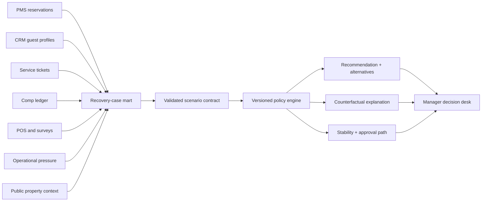

# Hotel Comp Policy Model

An explainable service-recovery decision system for a luxury lifestyle hotel:

> Given a service failure, guest relationship, operational constraints, and data confidence, what recovery gesture and amount should a manager consider?

The operating principle is **intelligent generosity**: protect the guest relationship and brand experience while controlling inconsistent recovery and unnecessary room-rate erosion.

## Example Decision

```text
Recommended recovery: $220 Calabra or Palma dining credit + manager note
Estimated internal cost range: $55-$132
Decision confidence: high (93% stability)
Manager approval: required

Counterfactual:
Without constrained room availability, the model would prefer a room upgrade.
```

All operating records, comp history, guest values, margins, and outcomes are synthetic. Official Santa Monica Proper pages provide bounded public context for available experiences and guest-facing value anchors. The project does not use or claim access to Proper Hotels internal data, policy, inventory, rates, margins, or guest records.

## Three-Minute Review

1. Open the hosted [stakeholder decision report](https://grant-mccurdy.github.io/projects/hotel-comp-policy-model/).
2. Use its four worked scenarios to compare recommendations, approval paths, alternatives, and decision-changing conditions.
3. Review the [methodology and assumptions](reports/methodology-and-assumptions.md) and [policy sensitivity report](reports/policy-sensitivity.md) for the supporting technical evidence.

The hosted [simulation audit dashboard](https://grant-mccurdy.github.io/projects/hotel-comp-policy-model/simulation-audit.html), [executive brief](reports/executive-comp-optimization-brief.md), and [official-property context](reports/proper-public-context.md) are supporting artifacts rather than the first-click deliverable. The repository-local `index.html` remains the canonical generated source for the hosted report.

## Decision Workflow



The source layer intentionally includes missing identifiers, duplicate CRM profiles, dirty issue and comp labels, delayed reviews, and orphaned ledger entries. Matching confidence and data-quality flags remain visible downstream.

## Recommendation Contract

Every recommendation includes:

- recovery gesture and guest-facing amount;
- estimated internal-cost range;
- recovery-need tier and manager-review flag;
- two nearest alternatives;
- causal reason codes and counterfactuals;
- stability under ±20% policy perturbations;
- decision confidence and policy version;
- explicit assumptions and unavailable internal inputs.

Invalid probabilities, negative values, impossible severity, and unknown categories are rejected before scoring.

## Data Evidence

| Layer | Status | Decision use |
| --- | --- | --- |
| Hotel Booking Demand | Observed public dataset | Booking and stay distribution shape |
| Santa Monica Proper public anchors | Observed official property sources | Recovery-option fit and guest-facing value anchors |
| Property and competitive-set context | Observed public summaries | Property-fit reasoning |
| Public rate context | Sample-seed by default; API-capable | Room-recovery stress testing |
| Review-risk and local-demand context | Sample-seed priors | Optional sensitivity inputs |
| PMS, CRM, service, comp, POS, survey, ops | Synthetic source systems | End-to-end operating workflow |
| Historical comps and recovery outcomes | Synthetic/unavailable | Policy demonstration only |

Public prices do not reveal contribution margin. Internal-cost ranges remain policy assumptions until actual property accounting data is available.

## Run Locally

On Debian or Ubuntu, install virtual-environment support once if `python3 -m venv` reports that `ensurepip` is unavailable:

```bash
sudo apt-get install python3-venv
```

Then create the isolated environment and run the complete local workflow:

```bash
python3 -m venv .venv
.venv/bin/python -m pip install -r requirements.txt
make PYTHON=.venv/bin/python local-all
```

Preview the stakeholder report:

```bash
python3 -m http.server 8000
```

Open `http://127.0.0.1:8000`. The root `index.html` is self-contained and its scenario examples are generated from the same versioned policy engine as the manager desk.

Start the supporting manager decision desk:

```bash
.venv/bin/python scripts/manager_app.py
```

Open `http://127.0.0.1:8765`. The JSON endpoint is available at `/recommend.json`, and `/healthz` supports deployment checks.

Container build:

```bash
docker build -t hotel-comp-policy-model .
docker run --rm -p 8765:8765 hotel-comp-policy-model
```

## Validation

```bash
make PYTHON=.venv/bin/python test
make PYTHON=.venv/bin/python validate
make PYTHON=.venv/bin/python public-audit
```

Validation covers input boundaries, deterministic output, severity monotonicity, operational constraints, public-rate counterfactuals, repeat-comp review, 250 randomized valid scenarios, data contracts, source-system messiness, and public-release safety. The stakeholder report and manager interface were reviewed at `1440x1200` and a true `390x844` mobile viewport. See the [stakeholder mobile overview](reports/screenshots/stakeholder-report-mobile.png), [stakeholder mobile decision](reports/screenshots/stakeholder-report-mobile-decision.png), and [manager recommendation](reports/screenshots/manager-desk-mobile-result.png).

## Warehouse Paths

DuckDB is the credential-free local warehouse. Snowflake is the cloud warehouse, with an optional S3 landing layer and external-stage `COPY INTO` path.

The current evidence run loaded 18 S3-backed tables and passed 26 Snowflake table/view checks. Public reports redact account-scoped bucket and role identifiers.

```bash
make snowflake-test
make snowflake-bootstrap
make snowflake-load
make snowflake-validate
make snowflake-extracts
```

Cloud credentials and account identifiers remain outside the repository. See [Snowflake setup](docs/snowflake-setup.md) and [AWS/S3 setup](docs/aws-s3-snowflake-setup.md).

## Project Boundary

This is a policy simulator, not an empirically optimized comp model. A production pilot requires real comp actions, manager overrides, post-recovery satisfaction, review outcomes, repeat stays, true marginal costs, live occupancy, room inventory, outlet capacity, and approved operating policy.
